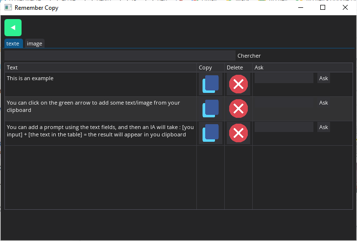

# **Magick-notes**


Magick-Notes is a small software built with PyDearGUI that allows you to pin notes. You can add text and images directly from your clipboard 📋

 




## Utilisation 
You can first start by cloning this repo : 
```.sh
git clone https://github.com/valeriancarrote/Magick-notes
```

```.sh
cd Magick-notes
```

You should next install the python requirement : 
```.sh
pip install -r requirement.txt
```
When everything is done, you just have to run it ! 

```.sh
python3 main.py
```

## Keyboard shortcut 
If you want to use this with a shortcut, you can execute shortcut.exe, then, when you presse ctrl + maj + H. The application will open 

If you want this to start 

## Todo list 
- [x] Add some IA to transform your texte
- [x] Support image 
- [x] Make it work with shortcut
- [ ] Drag and drop support ? 
- [ ] Texte image recongnition (ORC)
- [ ] IA texte analys
- [ ] Latex math expresion support 
- [ ] Paste file 

